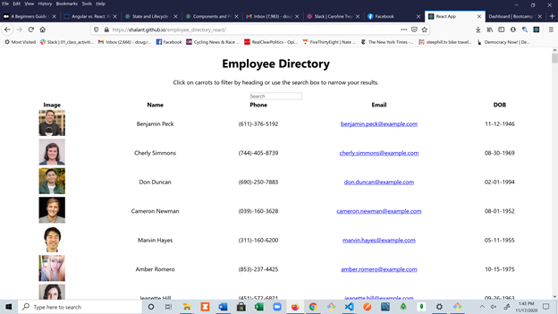

# Employee Directory React

This app takes an employee directory and makes it searchable by a variety of fields. In addition, the list of employees can be sorted by name.

## Motivation

This was a great HW assignment for learning the basics of React and how to hack away and get actual functionality.

## Code

Most of the code is obviously Javascript. A lot of packages were installed and you can find them in package.json. Basic React techniques were used to create a parent-child relationship.

## Screen shot

## How to use

Click on the gitpages link to the right to view the actual page. If you want to search by literally any query, the searchbox is what you want. To sort employees by name, click on the name column header.

## Future development

If I didn't have to spend time re-reviewing the intermediate class work, I would attempt to sort additional columns and add styling. Another tiny element I would have liked to add was a more appealing visual element on the sortable buttons.

## Contact

Send an e-mail to doug.rosenberg@gmail.com with questions, money, recipes, and input.